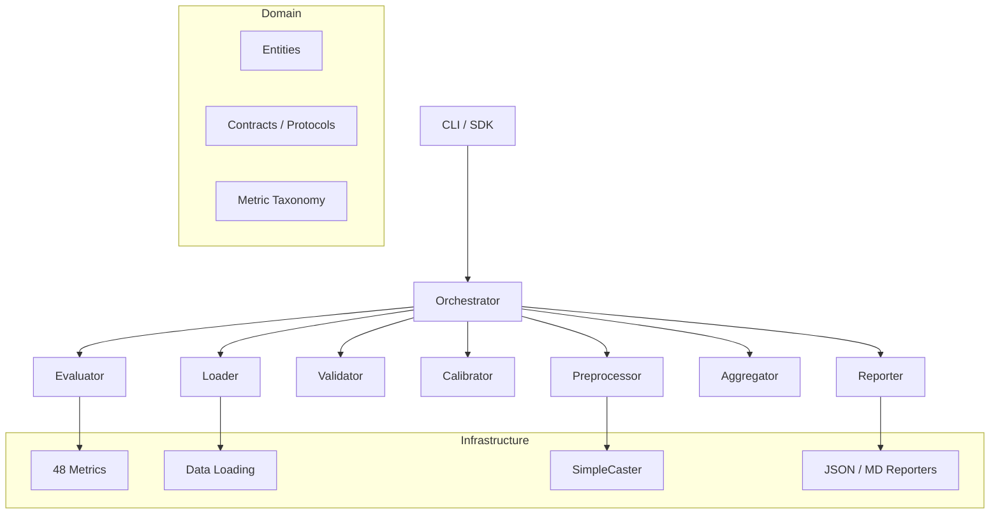

# Architecture

## Overview

METIS follows a **clean architecture** with clear separation of concerns:

## Layers

### Domain Layer (`metis/domain/`)

Pure business logic with no external dependencies:

- **Entities** — `EvalPlan`, `MetricResult`, `RunSummary`, `DatasetSpec`, `TransformedData`
- **Contracts** — Python Protocols defining interfaces (e.g., `Metric`, `MetricRegistry`)
- **Taxonomy** — Hierarchical metric classification and shortcut expansion
- **Errors** — Domain-specific exceptions (`ConfigError`, `SchemaError`, `RegistryError`)

### Application Layer (`metis/application/`)

Orchestration and pipeline composition:

- **Orchestrator** — Thin facade that chains pipeline steps
- **Pipeline steps** — Each satisfies a Protocol contract:
    - `DataLoader` → loads CSVs
    - `DataPreprocessor` → applies SimpleCaster
    - `DataValidator` → schema/NaN checks
    - `CalibrationStep` → bound estimation
    - `MetricEvaluator` → computes metrics
    - `ResultAggregator` → stochastic dominance aggregation
    - `ReportGenerator` → renders output

### Infrastructure Layer (`metis/infrastructure/`)

Technical implementations:

- **Metrics** — 48 registered metric classes (fidelity/, utility/, privacy/)
- **IO** — CSV loading, schema alignment
- **Preprocess** — `SimpleCaster` type transformation
- **Reporting** — JSON and Markdown reporters
- **Runtime** — Configuration, logging, caching

### Interface Layer (`metis/interface/`)

Entry points:

- **CLI** — `argparse`-based command-line interface
- **SDK** — `Evaluator` class and `evaluate_from_config()` function

## Design Principles

1. **Protocol-based contracts** — Steps are interchangeable via Python Protocols
2. **Decorator-based registration** — `@register("fidelity.ks")` auto-discovers metrics
3. **YAML-driven configuration** — Single source of truth
4. **Empirical calibration** — Data-driven normalization bounds
5. **Stochastic dominance** — Theoretically grounded aggregation
