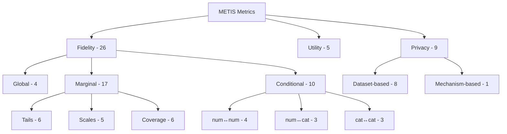

# Metric Taxonomy

## Hierarchical Organization

METIS organizes metrics in a three-level hierarchy:

```
Family → Category → Subcategory → Metric
```



## Shortcut Resolution

The `metrics:` section in YAML supports shortcuts at any level:

| Input | Resolution |
|-------|-----------|
| `"fidelity"` | All 26 fidelity metrics |
| `"fidelity.marginal"` | 17 marginal metrics (tails + scales + coverage) |
| `"fidelity.marginal.tails"` | 6 tail metrics |
| `"fidelity.ks"` | Single metric (leaf) |

## Families

### Fidelity

Measures how well the synthetic data reproduces the statistical properties of the real data.

- **Global** — Multivariate structure (correlation, distribution distance)
- **Marginal** — Univariate distributions per column
    - *Tails* — Distribution shape and tail behavior
    - *Scales* — Location and spread parameters
    - *Coverage* — Categorical/discrete coverage
- **Conditional** — Bivariate relationships between column pairs

### Utility

Measures how well the synthetic data preserves downstream ML performance.

- Train on synthetic, evaluate on real (and variants)
- ML model efficiency comparison

### Privacy

Measures protection against various attack scenarios.

- **Dataset-based** — Empirical attacks (DCR, NNAA, MIA, etc.)
- **Mechanism-based** — Theoretical guarantees (differential privacy)
